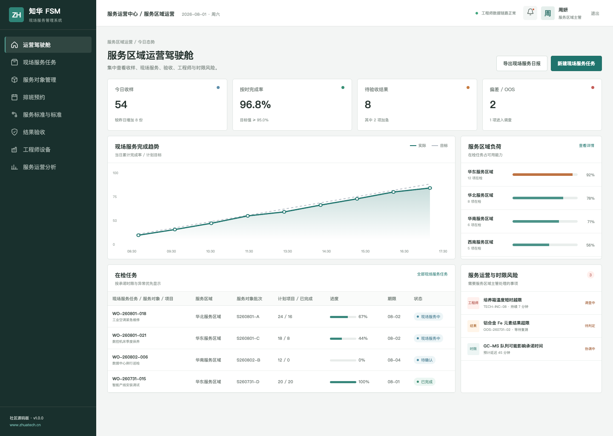
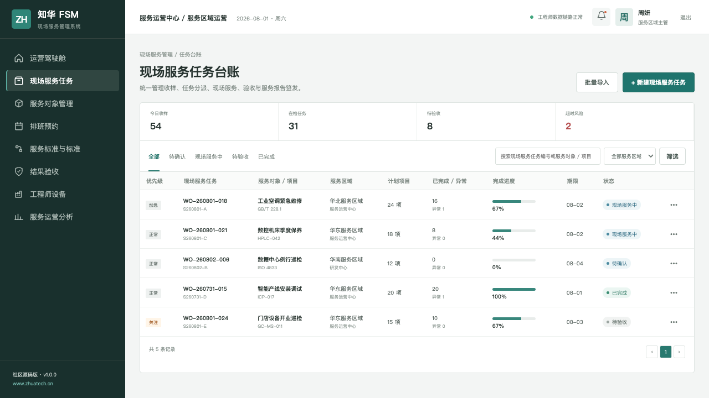
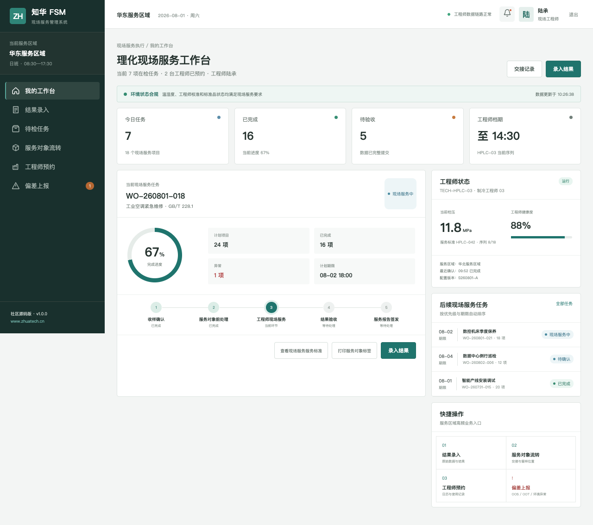

# ZhuaTech FSM Community Edition

## 现场服务管理系统

[](backend/pom.xml) [](frontend/package.json) [](compose.yaml) [](LICENSE)

连接服务受理、智能派工、现场执行、安全检查与客户验收。 本仓库是[知华科技](https://www.zhuatech.cn/)（上海如静知华信息科技有限公司）面向技术学习与交流发布的社区源码工程。

## 一眼了解业务

- **流程**：服务受理 → 工单分级 → 工程师派工 → 到场执行 → 安全验收 → 服务归档
- **用户**：现场工程师、服务调度主管、验收人员、系统管理员
- **终端**：后台管理端 + 响应式 H5 岗位端
- **特点**：可运行 API、MySQL 迁移、JWT 权限、领域化演示数据

1. 服务区域、工单优先级与派工计划
2. 工程师技能、路线排期和移动执行
3. 安全检查、服务报告、验收与 SLA 分析

## 产品实景

### 现场服务运营驾驶舱



### 工单调度与履约台账



### 现场工程师工作台



## 架构选型

| 部分 | 技术与职责 |
| --- | --- |
| 后端 | Java 21、Spring Boot、Spring Security、JPA、Flyway |
| 前端 | Vue 3、Pinia、Vue Router、Axios、Vite，响应式管理端与 H5 岗位端 |
| 数据 | MySQL 8；H2 集成测试 |
| 交付 | Docker Compose、Nginx、环境变量配置 |

Java 工程包名为 `cn.zhuatech.fsm`，数据库名为 `zhuatech_fsm`。角色覆盖现场工程师、服务调度主管、验收人员、系统管理员。

## 本地启动手册

仅看演示界面：

```bash
cd frontend
npm install
npm run dev:demo
```

打开 `http://localhost:5173`。管理端账号 `planner / Demo@2026`，岗位端账号 `operator / Demo@2026`。

完整启动：

```bash
cp .env.example .env
# 修改数据库密码与 JWT_SECRET
docker compose up --build
```

## 从演示到生产

仓库中的账号、客户、指标、工单和经营数据均为虚构演示数据。正式落地时应更换默认密码与 JWT 密钥，配置 HTTPS、最小权限、数据库备份、操作审计、脱敏策略，并按照所在行业完成安全与合规评估。

## 个人学习许可与企业授权

本工程仅允许个人、非商业性的学习、研究和技术交流，**不得商用**。企业内部使用、生产部署、SaaS、客户交付、收费培训、咨询实施及品牌替换，均须事先取得上海如静知华信息科技有限公司书面授权。完整条款见 [LICENSE](LICENSE)。

需要深度开发、私有化部署、系统集成或商业授权，请访问[知华科技官网](https://www.zhuatech.cn/)，也可扫码添加微信咨询：

| 微信咨询 1 | 微信咨询 2 |
| --- | --- |
|  |  |

搜索收录建议：FSM 源码、现场服务系统、工单派工、移动服务、Java FSM、Vue FSM、企业级 FSM、知华科技、上海如静知华信息科技有限公司。
